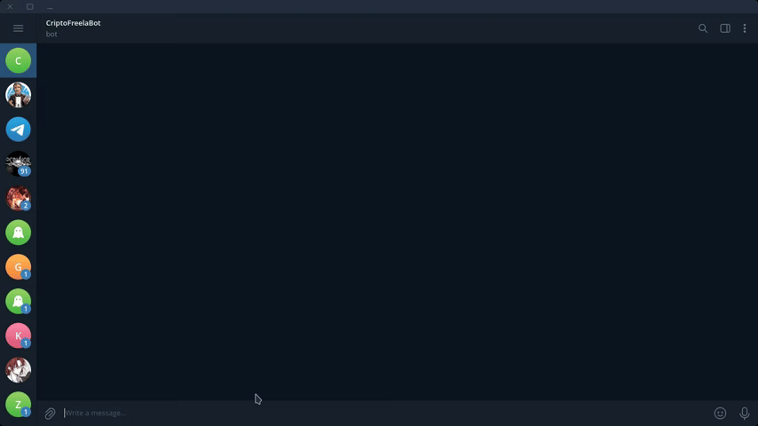

# Bot Multiplataforma de Preços de Criptomoedas

Este bot fornece o preço em tempo real de criptomoedas diretamente no seu servidor do Discord e no seu grupo do Telegram, utilizando a API da CoinGecko.

## O Problema Resolvido

Muitas comunidades online discutem sobre criptoativos e precisam de uma forma rápida e confiável de verificar preços sem sair da plataforma. Este bot resolve isso, centralizando a informação e respondendo a um comando simples.

## Funcionalidades

- **Suporte Duplo:** Funciona perfeitamente no Discord e no Telegram.
- **Preços em Tempo Real:** Busca os dados mais recentes da API da CoinGecko.
- **Cotação em BRL e USD:** Exibe os valores em Reais e Dólares americanos.
- **Fácil de Usar:** Basta um comando simples para obter a informação.
  - **Discord:** `/price bitcoin`
  - **Telegram:** `/price bitcoin`

## Demonstração



## Como Executar

1.  **Clone o repositório:**
    ```bash
    git clone https://github.com/Aletropy/freela-portfolio.git
    cd freela-portfolio/discord-telegram-bot
    ```

2.  **Instale as dependências:**
    ```bash
    npm install
    ```

3.  **Configure suas chaves de API:**
    - Renomeie o arquivo `.env.example` para `.env`. (Você pode criar um .env.example para mostrar as variáveis necessárias).
    - Preencha os tokens do Discord e Telegram no arquivo `.env`.

4.  **Compile e registre os comandos:**
    ```bash
    # Compila o código
    npm run build

    # Registra os comandos de barra (apenas para o Discord, uma única vez)
    npm run deploy
    ```

5.  **Inicie o bot:**
    ```bash
    npm start
    ```

## Tecnologias Utilizadas

- **Node.js**
- **TypeScript**
- **Discord.js** (para o bot do Discord)
- **Node-Telegram-Bot-API** (para o bot do Telegram)
- **Axios** (para chamadas HTTP à API da CoinGecko)
- **Dotenv** (para gerenciamento de variáveis de ambiente)

---

**Precisa de um bot personalizado para sua comunidade ou negócio? Entre em contato!**
- **Email:** nixanha.mim@gmail.com
- **LinkedIn:** https://www.linkedin.com/in/daviaportela/